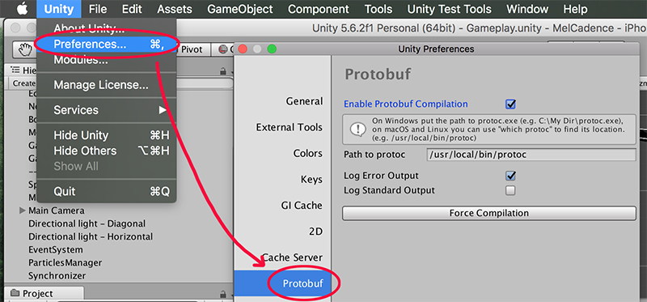
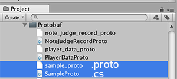
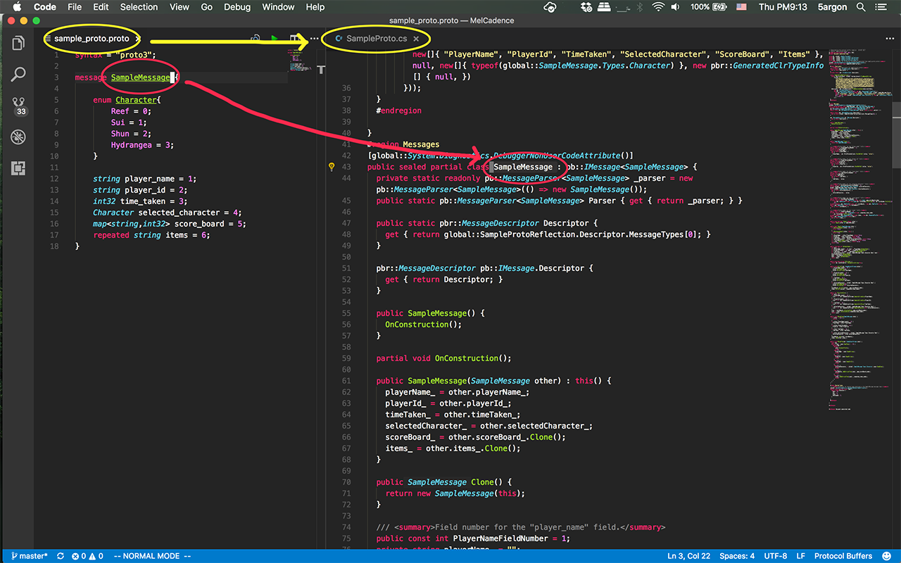

# protobuf-unity
Sirawat Pitaksarit / 5argon - Exceed7 Experiments



Do you want to integrate [protobuf](https://github.com/google/protobuf) as a data class, game saves, message to the server, etc. in your game? Now you can put those `.proto` files directly in the project, work on it, and have this generate the classes for you.

Why do you want to use Protobuf? Asides from smaller size if you used `System.Serializable` + `BinaryFormatter` before it breaks both forward and backward compatibility unpredictably, including just renaming your `asmdef` and the serialized file is now unreadable without binder hacks.

Protobuf is not only strong in forward-backward compatibility, but also flexible that it is a generic C# library, and the serialized file could potentially be read in other language like on your game server. For more Unity-tuned serialization, you may want to check out [Odin Serializer](https://github.com/TeamSirenix/odin-serializer).

## Functions

1. When you write a `.proto` file normally you need to use the `protoc` command line to generate C# classes. This plugin automatically find all your `.proto` files in your Unity project, generate them all, and output respective class file at the same place as the `.proto` file. It automatically regenerate when you change any `.proto` file. If there is an error the plugin will report via the Console. 

2. Your generated class will contains `using Google.Protobuf`, so you have to add `Google.Protobuf.dll` precompiled library in your Unity project or link to your `asmdef`. This plugin itself doesn't need it.

- I did not bundled the protobuf C# lib with this so go check at https://www.nuget.org/packages/Google.Protobuf, press Download manually, use archive extract tools to get the .dll out from nuget package and put it in your Unity project. It contains targets such as .NET 4.6 and .NET Standard 1.0/2.0.
- But if you stay with .NET 3.5 you need to use the unofficial modified package like https://github.com/emikra/protobuf3-cs. 
- The latest version (3.6.0) there is a patch note saying about some movement for this to work with .NET 3.5 and Unity (https://github.com/google/protobuf/blob/master/CHANGES.txt) I don't know if it works with 3.5 fully by now or not.

### Updates

- (1/12/2017) Now include paths is not only the folder of the file that is being compiled, but all folders that has a `.proto` file in your project. Proto includes on the `.proto` file's header does not support `.`, `..` etc. so this way you can use an unqualified name to reference any `.proto` file in your Unity project. Split assembly is available in 2017.3 and it uses folder hierarchy. This can help you split up your proto files.
- (29/07/2018) There is a `package.json` so you could use Unity Package Manager now.
- (26/05/2019) Added a utility class `ProtoSaveManager` to easily implement a local save file functionality for your game. You can use it to save and load Protobuf data to persistent folder of your game with basic encryption.

### Problem with iOS + IL2CPP

Now that you can't use mono backend anymore on iOS, there is a problem that IL2CPP is not supporting `System.Reflection.Emit`. Basically you should avoid anything that will trigger reflection as much as possible.

Luckily the most of core funtions does not use reflection. The most likely you will trigger reflection is `protobufClassInstance.ToString()` (Or attempting to `Debug.Log` any of the protobuf instance.) It will then use reflection to scan figure out what is the structure of all the data just to print out pretty JSON-formatted string. To alleviate this you might override `ToString` so that it pull the data out to make a string directly from generated class file's field. I am not sure of other functions that might trigger reflection.

You should see the discussion in [this](https://github.com/google/protobuf/issues/644) and [this](https://github.com/google/protobuf/pull/3794) thread. The gist of it is Unity failed to preserve some information needed for the reflection and it cause the reflection to fail at runtime.

And lastly the latest protobuf (3.6.0) has something related to this issue. Please see https://github.com/google/protobuf/blob/master/CHANGES.txt
So it is recommended to get the latest version!

## Installation 

1. Put files in your Unity project
2. You can access the settings in Preferences > Protobuf. Here you *need* to put a path to your `protoc` executable.


3. As soon as you import/reimport/modify (but *not* moving) `.proto` file in your project, it will compile *only that file* to the same location as the file. If you want to temporary stop this there is a checkbox in the settings, then you can manually push the button in there if you like. Note that deleting `.proto` file will not remove its generated class.
 
## Prerequisites

Requires `protoc`. This plugin does not include `protoc` command and will try to run it from your command line (via .NET `System.Diagnostics.Process.Start`). Please see https://github.com/google/protobuf and install it. Confirm with `protoc --version` in your command prompt/terminal.

## Some notes about Protocol Buffer

For complete understanding I suggest you visit [Google's document](https://developers.google.com/protocol-buffers/docs/overview) but here are some gotchas you might want to know before starting.

- Use CamelCase (with an initial capital) for message names, for example, SongServerRequest. Use underscore_separated_names for field names – for example, song_name.
- By default of C# `protoc`, the `underscore_names` will become `PascalCase` and `camelCase` in the generated code.
- `.proto` file name matters and Google suggests you use `underscore_names.proto`. It will become the output file name in `PascalCase`. (Does not related to the file's content or the message definition inside at all.)
- The comment in your `.proto` file will carry over to your generated class and fields if that comment is over them. Multiline supported.
- Field index 1 to 15 has the lowest storage overhead so put fields that likely to occur often in this range.
- The generated C# class will has `sealed partial`. You could write more properties to design new access or write point.
- You cannot use `enum` as `map`'s key.
- You cannot use duplicated `enum` name even if they are not in the same type. You may have to prefix your `enum` especially if they sounded generic like `None`.
- It's not `int` but `int32`. And this data type is not efficient for negative number. (In that case use `sint32`)





## Problems

Works on macOS. Untested on Windows/Linux since I am not developing games in those environments. If you encountered any problems please use the Issue section or send a PR if you managed to fix it. Thank you.

## ProtoSaveManager

This is an `abstract` class. By providing your Protobuf-generated class `T` in the type parameter, you will get a manager for that specific class `T` to easily save and load Protobuf data to disk and back to memory. The most common use is as a local game saves, but you could use it for any data.

```csharp
//Recommended naming is `LocalSave`. The LocalSave 2nd type param will give you magic `static` access point later.
public class LocalSave : ProtobufSaveManager<T, LocalSave> { 
    //Implement required `abstract` implementations...
}

// Then later you could :

//`.Active` static access point for your save data. Automatic load from disk and cache. `Gold` is a property in your generated `T` class from Protobuf.
LocalSave.Active.Gold += 5555;

//.Save easy static method to save your active save file to the disk.
LocalSave.Save();

//When you start the game the next time, LocalSave.Active will contains your previous state because .Active automatically load from disk.

//Other utilities provided in `.Manager` static access point.
LocalSave.Manager.BackupActive();
LocalSave.Manager.ReloadActive();
```

## License
As this will need Protobuf you need to follow Google's license here : https://github.com/google/protobuf/blob/master/LICENSE

For my own Unity code the license is MIT without requiring any attributions. (The part where it says "The above copyright notice and this permission notice shall be included in all copies or substantial portions of the Software." is not required.) You are welcome to include it if you want.