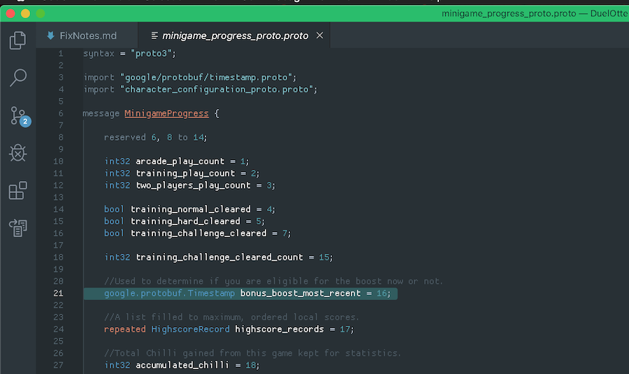
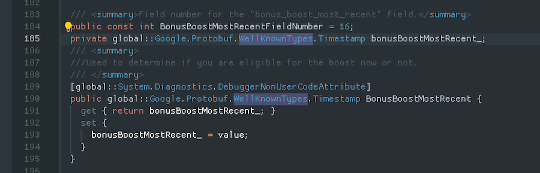
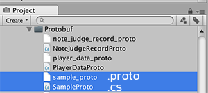
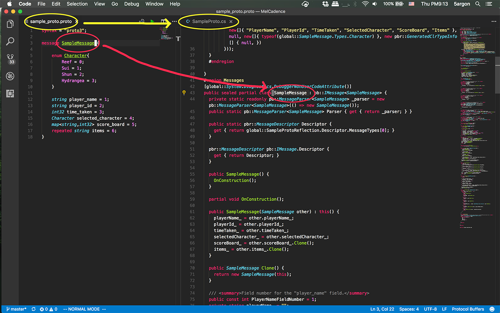

# protobuf-unity


Do you want to integrate [protobuf](https://github.com/google/protobuf) as a data class, game saves, message to the server, etc. in your game? Now you can put those `.proto` files directly in the project, work on it, and have the editor script in here generate the classes for you.

# Installation 

1. Install `protoc` on the machine. This plugin does not include `protoc` command and will try to run it from your command line (via .NET `System.Diagnostics.Process.Start`). Please see https://github.com/google/protobuf and install it. Confirm with `protoc --version` in your command prompt/terminal.
2. Put files in your Unity project. This is also Unity Package Manager compatible. You can pull from online to your project directly.
3. You can access the settings in Preferences > Protobuf. Here you *need* to put a path to your `protoc` executable.


As soon as you import/reimport/modify (but *not* moving) `.proto` file in your project, it will compile *only that file* to the same location as the file. If you want to temporary stop this there is a checkbox in the settings, then you can manually push the button in there if you like. Note that deleting `.proto` file will *not* remove its generated class.

## Grpc

1. Download [csharp grpc plugin](http://packages.nuget.org/api/v1/package/Grpc.tools) and put it somewhere safe.
2. Set the path to this plugin in the editor shown above

Leave empty or like it is if you don't want to use gRPC

# Overview

1. When you write a `.proto` file normally you need to use the `protoc` command line to generate C# classes. This plugin automatically find all your `.proto` files in your Unity project, generate them all, and output respective class file at the same place as the `.proto` file. It automatically regenerate when you change any `.proto` file. If there is an error the plugin will report via the Console. 

2. You could use `import` statement in your `.proto` file, which normally looks for all files in `--proto_path` folders input to the command line. (You cannot use relative path such as `../` in `import`) With protobuf-unity, `--proto_path` will be all parent folders of all `.proto` file in your Unity project *combined*. This way you can use `import` to refer to any `.proto` file within your Unity project. (They should not be in UPM package though, I used `Application.dataPath` as a path base and packages aren't in here.) Also, `google/protobuf/` path is usable. For example, utilizing [well-known types](https://github.com/protocolbuffers/protobuf/blob/master/src/google/protobuf/unittest_well_known_types.proto) or extending [custom options](https://developers.google.com/protocol-buffers/docs/proto#customoptions).

3. Your generated class will then contains `using Google.Protobuf` usage, so additionally you have to add `Google.Protobuf.dll` precompiled library in your Unity project or link to your `asmdef`. This plugin itself doesn't need it, and I didn't bundle the `dll` along with this. You can go to [the repo](https://github.com/protocolbuffers/protobuf) and compile manually or download [the Nuget package](https://www.nuget.org/packages/Google.Protobuf) then use archive extract tools to get the .dll out. It contains targets such as .NET 4.6 and .NET Standard 1.0/2.0. Then it will ask for `System.Memory.dll` because it want to use `Span` class but Unity is not supporting it yet. By also [downloading it](https://www.nuget.org/packages/System.Memory/), it will then ask for missing references `System.Runtime.CompilerServices.Unsafe` [here](https://www.nuget.org/packages/System.Runtime.CompilerServices.Unsafe/) and `System.Buffers` [here](https://www.nuget.org/packages/System.Buffers/). With all 4 libraries, it works in the real device just fine as far as I tested.

## How to use Google-made well known types

Maybe you are thinking about storing time, for your daily resets, etc. Storing as C# `.ToString()` of `DateTime`/`DateTimeOffset` is not a good idea. Storing it as an integer seconds / milliseconds from Unix epoch and converting to `DateTimeOffset` later is a better idea.

But instead of using generic `int32/64` which is prone to error when you look at it later what this number supposed to represent, Google already has `Timestamp` ready for use waiting in the protobuf's DLL you need to include in the Unity project (`Google.Protobuf.WellKnownTypes.___`), so you don't even have to copy Google's `.proto` of `Timestamp` into your game. (That will instead cause duplicate declaration compile error.)

Google's `Timestamp` [consist of 2 number fields](https://github.com/protocolbuffers/protobuf/blob/master/src/google/protobuf/timestamp.proto), an `int64` for seconds elapsed since Unix epoch and an `int32` of nanoseconds in that second for extra accuracy. What's even more timesaving is that Google provided utility methods to interface with C#. (Such as `public static Timestamp FromDateTimeOffset(DateTimeOffset dateTimeOffset);`)

Here's how you do it in your `.proto` file.



`google/protobuf/` path is seemingly available for `import` from nowhere. Then you need to fully qualify it with `google.protobuf.__` since Google used `package google.protobuf;`.

Resulting C# class looks like this :



See other predefined [well-known types](https://developers.google.com/protocol-buffers/docs/reference/google.protobuf). You will see other types already used for typical data types such as `uint32` as well. Other useful one are [`google.Protobuf.Struct`](https://developers.google.com/protocol-buffers/docs/reference/google.protobuf#struct) where it could store JSON-like key value pair where the key is string and value is varying type. Use [`google.Protobuf.Value`](https://developers.google.com/protocol-buffers/docs/reference/google.protobuf#google.protobuf.Value) for only the varying value type part of the `Struct`. I think generally when you think you are going to use `google.Protobuf.Any`, think of `Struct` first. (Unless it is really a byte stream.)

## Why Protobuf?

- Smaller size, no big luggages like type information when if you used `System.Serializable` + `BinaryFormatter`.
- You could use Unity's `ScriptableObject`, but one well-known gotchas is that Unity can't serialize `Dictionary`. Here you could use [`map<,>`](https://developers.google.com/protocol-buffers/docs/proto3#maps) in protobuf together with available protobuf types. [Any](https://developers.google.com/protocol-buffers/docs/proto3#any) and [Oneof](https://developers.google.com/protocol-buffers/docs/proto3#oneof) could be very useful too.
- `System.Serializable` is terrible on both forward and backward compatibility unpredictably, may affect your business badly. (e.g. you wanna change how your game's monetization works, that timed ads that was saved in the save file is now unnecessary, but because inflexibility you have to live with them forever in the code.)
- For Unity-specific problem, just rename your `asmdef` and the serialized file is now unreadable without binder hacks because `BinaryFormatter` needs fully qualified assembly name.
- Protobuf is flexible that it is a generic C# library, and the serialized file could potentially be read in other languages like on your game server. For more Unity-tuned serialization, you may want to check out [Odin Serializer](https://github.com/TeamSirenix/odin-serializer).
- Protobuf-generated C# class is powerful. It comes with sensible `partial` and some useful data merging methods which otherwise would be tedious and buggy for a class-type variable. (e.g. it understands how to handle list-like and dictionary-like data, the `repeated` field and `map` field.)
- Programming in `.proto` to generate a C# class is simply faster and more readable than C# to get the same function. (e.g. has properties, null checks, bells and whistles, and not just all C# `public` fields.)

Here's one interesting rebuttal against Protobuf : http://reasonablypolymorphic.com/blog/protos-are-wrong/
And here's one interesting counter argument from the author : https://news.ycombinator.com/item?id=18190005

Use your own judgement if you want it or not! 

## Problem with iOS + IL2CPP

Now that you can't use mono backend anymore on iOS, there is a problem that IL2CPP is not supporting `System.Reflection.Emit`. Basically you should avoid anything that will trigger reflection as much as possible.

Luckily the most of core funtions does not use reflection. The most likely you will trigger reflection is `protobufClassInstance.ToString()` (Or attempting to `Debug.Log` any of the protobuf instance.) It will then use reflection to figure out what is the structure of all the data to print out pretty JSON-formatted string. To alleviate this you might override `ToString` so that it pull the data out to make a string directly from generated class file's field. I am not sure of other functions that might trigger reflection.

You should see the discussion in [this](https://github.com/google/protobuf/issues/644) and [this](https://github.com/google/protobuf/pull/3794) thread. The gist of it is Unity failed to preserve some information needed for the reflection and it cause the reflection to fail at runtime.

And lastly the latest protobuf (3.6.0) has something related to this issue. Please see https://github.com/google/protobuf/blob/master/CHANGES.txt
So it is recommended to get the latest version!

## Some more notes about Protocol Buffer

For complete understanding I suggest you visit [Google's document](https://developers.google.com/protocol-buffers/docs/overview) but here are some gotchas you might want to know before starting.

- Use CamelCase (with an initial capital) for message names, for example, SongServerRequest. Use underscore_separated_names for field names – for example, song_name.
- By default of C# `protoc`, the `underscore_names` will become `PascalCase` and `camelCase` in the generated code.
- `.proto` file name matters and Google suggests you use `underscore_names.proto`. It will become the output file name in `PascalCase`. (Does not related to the file's content or the message definition inside at all.)
- The comment in your `.proto` file will carry over to your generated class and fields if that comment is over them. Multiline supported.
- Field index 1 to 15 has the lowest storage overhead so put fields that likely to occur often in this range.
- The generated C# class will has `sealed partial`. You could write more properties to design new access or write point.
- You cannot use `enum` as `map`'s key.
- You cannot use duplicated `enum` name even if they are not in the same type. You may have to prefix your `enum` especially if they sounded generic like `None`.
- It's not `int` but `int32`. And this data type is not efficient for negative number. (In that case use `sint32`)
- If you put `//` comment (or multiline) over a field or message definition, it will be transferred nicely to C# comment.
- It is [possible to generate a C# namespace](https://developers.google.com/protocol-buffers/docs/reference/csharp-generated#structure).
- The generated class contains parameterless constructor definition, but you still could interfere and add something more because it call `partial void OnConstruction()`, which has no definition and you can add something to it in your handwritten `partial`. This is C#'s [partial method](https://docs.microsoft.com/en-us/dotnet/csharp/language-reference/keywords/partial-method) feature that works similar to a `partial` class.
- One thing to note about the timing of `OnConstruction` though, it is called before any data is populated to the instance. For example, if I got a `repeated` `int32` of highscores, I am thinking about maintaining this list to have exactly 10 scores at any moment. To ensure this I add some logic to fill it with empty scores until it has 10 count in `OnConstruction`. However, I later found that when loading from a save file that already has scores (let's say 10 scores as intended), `OnConstruction` comes before `repeated` list is populated from the stream. My code see it as empty where actually it is going to be populated a bit later. The result is I get 20 scores in the deserialized list.





# ProtoBinaryManager

This is a Unity-specific utility to deal with physical file save-load of your generated protobuf class. This is perfect for game saves so you can load it from binary on the next start up. It has 2 versions, a completely `static` utility class and an `abstract` version which requires some generic typing.

The point of generic version is that, by providing your Protobuf-generated class `T` in the type parameter, you will get a manager just for that specific class `T` to easily save and load Protobuf data to disk and back to memory, plus an extra static "active slot" of that `T` for an even easier management of loaded data. (So you don't load it over and over, and save when necessary.) The most common use of this active slot is as a local game saves, since nowadays mobile games are single-save and there is usually no explicit load screen where you choose your save file. There are methods you can use to implement other game save schemes. And because you subclass it, it open ways for your validation logic which would be impossible with just the `static` utility version.

It also contains some basic C# AES encryption, I think almost everyone wants it even though you are likely too lazy to separate key and salt from your game's code. At least it is more difficult for the player to just open the serialized protobuf file with Note Pad and see exactly where his money variable is.

```csharp
//Recommended naming is `LocalSave`. The LocalSave 2nd type param will give you magic `static` access point later.
public class LocalSave : ProtoBinaryManager<T, LocalSave> { 
    //Implement required `abstract` implementations...
}

// Then later you could :

//`.Active` static access point for your save data. Automatic load from disk and cache. `Gold` is a property in your generated `T` class from Protobuf.
LocalSave.Active.Gold += 5555;

//.Save easy static method to save your active save file to the disk.
LocalSave.Save();

//When you start the game the next time, LocalSave.Active will contains your previous state because .Active automatically load from disk.

//Other utilities provided in `.Manager` static access point.
LocalSave.Manager.BackupActive();
LocalSave.Manager.ReloadActive();
```

# Special post processor by custom options (WIP)

There are some problems with Protobuf-generated C# code that I am not quite content with : 

- The generated properties are all `public get` and `public set`, this maybe not desirable. For example your `Gem` property could be modified by everyone and that's bug-prone. You probably prefer some kind of `PurchaseWithGem(iapItem)` method in your `partial` that decreases your `Gem` and keep the setter `private`.
- The class contains `partial`, I would like to use `partial` feature and don't want to make a completely new class as a wrapper to this protobuf-generated class. It would be easier to handle the serialization and data management. Also I don't want to redo all the protobuf-generated utility methods like `MergeFrom` or deep `Clone`.
- Some fields in `proto` like `map` are useful as Unity couldn't even serialize `Dictionary` properly, but it is even more likely than normal fields that you don't want anyone to access this freely and add things to it. Imagine a `map<string,string>` describing friend's UID code to the string representation of `DateTime` of when they last online. It doesn't make sense to allow access to this map because `string` doesn't make sense. You want it completely `private` then write a method accessor like `RememberLastOnline(friend, dateTime)` to modify its value, and potentially call the save method to write to disk at the same time.
- These unwanted accessors show up in your intellisense and you don't want to see them.

So I want some more control over the generated C# classes. One could utilize the [Compiler Plugin feature](https://developers.google.com/protocol-buffers/docs/reference/other#plugins), but I think it is overkill. I think I am fine with just some dumb RegEx replace over generated C# classes in Unity as a 2nd pass.

The next problem is how to select some fields or message to be triggered by this post-processing. It will be by [custom options feature](https://developers.google.com/protocol-buffers/docs/proto3#custom_options). In the folder `Runtime/CustomOptions`, there is a `protobuf_unity_custom_options.proto` file that extends the options to Protobuf.

- If you use protobuf-unity by copying the whole thing into your project, it will be in your `import` scope already, plus protobuf-unity will generate its C# counterpart.
- If you use protobuf-unity via UPM include, I don't want to deal with path resolving to the package location so `protoc` knows where the `protobuf_unity_custom_options.proto` is. A solution is just copy this `.proto` file to your project. protobuf-unity will then generate its C# file again locally in your project. protobuf-unity has an exception that it will not generate C# script for `.proto` coming from packages.

You then use `import "protobuf_unity_custom_options.proto";` on the head of `.proto` file that you want to use the custom options. The generated C# file of this class of yours, will then have a reference to the C# file of `protobuf_unity_custom_options.proto` (namely `ProtobufUnityCustomOptions.cs`)

Right now this custom options gives you 1 message option `private_message` and 1 field option `private`. Unfortunately I think options can't be just a flag, so they are boolean and you have to set them to `true`.

```protobuf
syntax = "proto3";
import "enums.proto";
import "protobuf_unity_custom_options.proto";

message PlayerData {

    option (private_message) = true; // Using message option

    string player_id = 1;
    string display_name = 2 [(private)=true]; // Using field option
}
```

`private` would apply tighter accessor to only one field, `private_message` apply to all fields in the message. But yeah, I didn't work on that yet. I just want to write these documentation as I code. :P

# Interoperate with games backend

`protobuf-unity` and `ProtoBinaryManager` together deals with your **offline** save data. What about taking that online? Maybe it is just for backing up the save file for players (without help from e.g. iCloud), or you want to be able to view, inspect, or award your player something from the server.

## JSON at client side

The point of protobuf is often to sent everything over the wire with matching protobuf files waiting. But what if you are not in control of the receiving side? The key is often JSON serialization, since that is kinda the standard of interoperability. And what I just want to tell you is to know that there is a class called [`Google.Protobuf.JsonFormatter`](https://developers.google.com/protocol-buffers/docs/reference/csharp/class/google/protobuf/json-formatter) available for use from Google's dll already.

How to use it is just instantiate that class instance (or `JsonFormatter.Default` for no config quick formatting) then `.Format(yourProtobufMessageObject)`. It uses a bunch of reflections to make a key value pairs of C# variable name and its value which may not be the most efficient solution, but it did the trick.

If you want to see what the JSON string looks like, here is one example of `.Format` from my game which contains some nested Protobuf messages as well. That's a lot of strings to represent C# field names. I heard it didn't work well with `any`, not sure. But `repeated` works fine as JSON array `[]` as far as I see it.

```json
"{ "playerId": "22651ba9-46c6-4be6-b031-d8373fe5c6de", "displayName": "5ARGON", "playerIdHash": -1130147695, "startPlaying": "2019-08-31T09:30:26", "minigameProgresses": { "AirHockey": { "trainingPlayCount": 4, "twoPlayersPlayCount": 1, "trainingHardCleared": true, "trainingChallengeCleared": true, "trainingChallengeClearedCount": 1, "bonusBoostMostRecent": "1970-01-01T00:03:30Z", "accumulatedChilli": 1963, "hardClearStreak": 1, "challengeClearStreak": 1, "inGameTraining": true }, "PerspectiveBaseball": { "arcadePlayCount": 5, "twoPlayersPlayCount": 5, "bonusBoostMostRecent": "2019-09-01T06:43:10Z", "highscoreRecords": [ { "playerName": "PLAYER5778", "score": 40355, "localTimestamp": "2019-09-02T10:38:59.737323Z", "characterConfiguration": { } }, { "playerName": "PLAYER5778", "score": 34805, "localTimestamp": "2019-09-02T10:40:47.862259Z", "characterConfiguration": { } }, { "playerName": "5ARGON", "score": 8495, "localTimestamp": "2019-09-04T09:46:10.733110Z", "characterConfiguration": { } }, { "playerName": "PLAYER5778", "localTimestamp": "2019-09-01T06:43:41.571264Z", "characterConfiguration": { } }, { "localTimestamp": "1970-01-01T00:00:00Z" }, { "localTimestamp": "1970-01-01T00:00:00Z" }, { "localTimestamp": "1970-01-01T00:00:00Z" }, { "localTimestamp": "1970-01-01T00:00:00Z" }, { "localTimestamp": "1970-01-01T00:00:00Z" }, { "localTimestamp": "1970-01-01T00:00:00Z" } ], "accumulatedChilli": 4066 }, "BlowItUp": { "trainingPlayCount": 1, "twoPlayersPlayCount": 4, "trainingHardCleared": true, "accumulatedChilli": 1114, "hardClearStreak": 1 }, "CountFrog": { }, "BombFortress": { "trainingPlayCount": 1, "twoPlayersPlayCount": 2, "trainingHardCleared": true, "trainingChallengeCleared": true, "trainingChallengeClearedCount": 1, "accumulatedChilli": 1566, "hardClearStreak": 1, "challengeClearStreak": 1 }, "StackBurger": { "twoPlayersPlayCount": 2 }, "SwipeBombFood": { }, "CookieTap": { }, "Rocket": { }, "Pulley": { "trainingPlayCount": 2, "accumulatedChilli": 146 }, "Pinball": { }, "Fruits": { }, "Warship": { "twoPlayersPlayCount": 3 } }, "characterConfigurations": { "0": { }, "1": { "kind": "CharacterKind_Bomberjack" } }, "chilli": 58855, "permanentEvents": [ "FirstLanguageSet", "GameReviewed" ], "trialTimestamps": { "Fruits": "2019-09-04T09:57:09.631383Z", "Warship": "2019-09-04T10:34:34.249723Z" }, "savedConfigurations": { "autoGameCenter": true }, "purchasableFeatures": [ "RecordsBoard" ] }"
```

 If just for backup, you may not need JSON and just dump the binary or base 64 of it and upload the entire thing. But JSON often allows the backend to actually **do something** about it. You may think that there is one benefit of Protobuf that it could be read in a server, so shouldn't we just upload the message instead of JSON? But that maybe only your own server which you code up yourself. For other commercial solutions maybe you need JSON.
 
 For example [Microsoft Azure Playfab](https://playfab.com/) supports [attaching JSON object](https://docs.microsoft.com/en-us/gaming/playfab/features/data/entities/quickstart#entity-objects) to your entity. Then with understandable save data available in Playfab, you are able to segment and do live dev ops based on the save, e.g. the player that progressed slower in the game. Or award points from the server on event completion, then the player sync back to Protobuf in the local device. (However attaching a generic file [is also possible](https://docs.microsoft.com/en-us/gaming/playfab/features/data/entities/quickstart#entity-files).)
 
## Deciphering Protobuf at server side

As opposed to doing JSON at client side and send it to server, how about sending protobuf bytes to the server and deserialize with JS version of generated code instead?

### Node JS example

Here's an example how to setup Node's `Crypto` so it decrypts what C# encrypted in my code. I used this pattern in my Firebase Functions where it spin up Node server with a lambda code fragment, receiving the save file for safekeeping and at the same time decipher it so server knows the save file's content. Assuming you have already got a Node `Buffer` of your save data at the server as `content` : 

```js
function decipher(saveBuffer)
{
    //Mirrors `Rfc2898DeriveBytes` in C#. Use the same password and salt, and iteration count if you changed it.
    const key = pbkdf2Sync(encryptionPassword, encryptionSalt, 5555, 16, 'sha1')

    //Pick the IV from cipher text
    const iv = saveBuffer.slice(0, 16)

    //The remaining real content
    const content = saveBuffer.slice(16)

    //C# default when just creating `AesCryptoServiceProvider` is in CBC mode and with PKCS7 padding mode.
    const decipher = createDecipheriv('aes-128-cbc', key, iv)

    const decrypted = decipher.update(content)
    const final = decipher.final()
    const finalBuffer = Buffer.concat([decrypted, final])

    //At this point you get a naked protobuf bytes without encryption.
    //Now you can obtain a nicely structured class data.
    return YourGeneratedProtoClassJs.deserializeBinary(finalBuffer)
}
```

### Compatibility with Google Firebase Firestore

Firestore could store JSON-like data, and the JS Firestore library can store JS object straight into it. However not everything are supported as JS object is a superset of what Firestore supports.

One thing it cannot store `undefined`, and other it cannot store nested arrays. While `undefined` does not exist in JSON, nested array is possible in JSON but not possible to be stored in Firestore.

 What you get from `YourGeneratedProtoClassJs.deserializeBinary` is not JS object. It is a `class` instance of Protobuf message. There is a method `.ToObject()` available to change it to JS object, but if you take a look at what you had as `map<A,B>`, the `.ToObject()` produces `[A,B][]` instead. This maybe how Protobuf really keep your `map`. Unfortunately as I said, nested array can't go straight into Firestore.

After eliminating possible `undefined` or `null`, you need to manually post-process every `map` field (and nested ones), changing `[A,B][]` into a proper JS object by using `A` as key and `B` as value by looping over them and replace the field.

`repeated` seems to be `ToObject()`-ed just fine. It is just a straight array.

## Bugs?

- `repeated` enum : It works serializing at C# and deserializing at C# just fine. But if you get `Unhandled error { AssertionError: Assertion failed` when trying to turn the buffer made from C# into JS object, it may be [this bug from a year ago](https://github.com/protocolbuffers/protobuf/issues/5232). I just encountered it in protobuf 3.10.0 (October 2019). Adding `[packed=false]` does not fix the issue for me.
- Integer map with key 0. I found a bug where `map<int, Something>` works in C# but fail to deserialize in JS. As long as [this](https://github.com/protocolbuffers/protobuf/issues/7713) is not fixed, use number other than 0 for your integer-keyed `map`.

# License

As this will need Protobuf you need to follow Google's license here : https://github.com/google/protobuf/blob/master/LICENSE. For my own code the license is MIT.