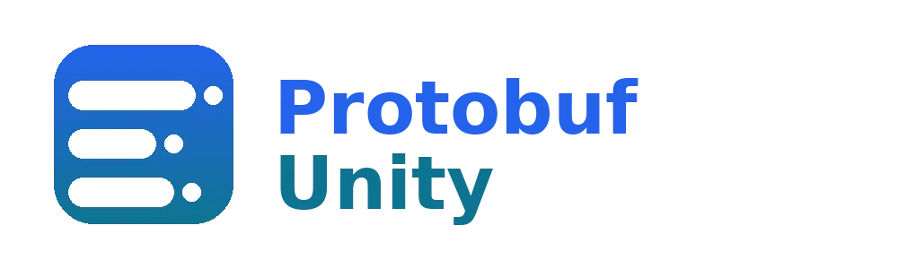

<div class="exc7-hero">
    
    <h1 class="exc7-hero-title">Protobuf Unity</h1>
    <p class="exc7-hero-desc">Automatic <code>.proto</code> compilation in Unity to C# as you edit, plus Protobuf utilities made for games.</p>
</div>

> [!NOTE]
> Requires Unity 6.3 LTS (6000.3) or newer. You also need the `protoc` compiler installed on your machine — this package runs it, it does not bundle it. See [Installation](manual/installation.md).

Do you want to integrate [Protobuf](https://github.com/protocolbuffers/protobuf) as a data class, game saves, or a message to your server? Drop the `.proto` files directly into your project, edit them, and the editor script here regenerates the C# classes for you automatically — no manual `protoc` command line, no build step.

- [How it works](manual/index.md) — automatic per-file compilation, project-wide `import` resolution, and why Protobuf is a good fit for game data.
- [`ProtoBinaryManager`](manual/proto-binary-manager.md) — a Unity-specific save/load utility (with optional AES encryption) built for game saves.
- The bundled [`Google.Protobuf`](manual/google-protobuf.md) runtime means serialization works out of the box.

## Getting started

Install with the Package Manager using **Add package from git URL**:

```
https://github.com/5argon/protobuf-unity.git?path=src/protobuf-unity/Assets/protobuf-unity
```

Or add it directly to your `Packages/manifest.json`:

```json
"com.e7.protobuf-unity": "https://github.com/5argon/protobuf-unity.git?path=src/protobuf-unity/Assets/protobuf-unity"
```

To pin a version, append `#` and a release tag, e.g. `...protobuf-unity.git?path=src/protobuf-unity/Assets/protobuf-unity#2.0.0`. Otherwise it resolves to the latest commit; remove its entry from `Packages/packages-lock.json` to refetch newer commits.

The `?path=` points at the innermost package folder in this repo's [UniTask-style](https://github.com/Cysharp/UniTask) layout. You can also clone and open `src/protobuf-unity` directly as a Unity project to develop the package itself.

Then head to [Installation](manual/installation.md) to point the plugin at your `protoc` executable, and browse the [Manual](manual/index.md) for usage.

## Samples

The package ships importable samples. With the package installed, open **Window > Package Manager**, select **Protobuf Unity**, and use the **Samples** tab's **Import** buttons:

- **Save Data Schema** — a multi-file `.proto` graph across folders demonstrating imports, a shared package, well-known types, and proto3 features. Dependency-free; it only needs the bundled `Google.Protobuf`.
- **gRPC Service** — a `service` definition (unary + server streaming) with setup notes. Requires a gRPC runtime (see [gRPC](manual/grpc.md)); not needed for plain serialization.
- **Split Compilation** — two folders that generate C# with different `--csharp_opt` settings (one `internal`, one `public`) via a per-folder options asset. See [C# output options](manual/csharp-output.md).

## Easy way to pay for this software

Are you looking for a way to say thanks to this open source work other than code contribution?

It is easy! You can take a look at my myriad of niche Unity Asset Store **audio plugins** in [my publisher page](https://assetstore.unity.com/publishers/18007), grab something for your game, or tell your audio-caring friends about them. Thank you!

## License

For your generated code you must follow [Google's Protobuf license](https://github.com/protocolbuffers/protobuf/blob/main/LICENSE). For this package's own code, the license is MIT. You should do your part in the open source software movement.
