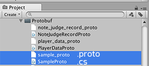

# Notes & Gotchas

## Problem with iOS + IL2CPP

Now that you can't use the Mono backend on iOS, there is a problem: IL2CPP does not support `System.Reflection.Emit`. Basically you should avoid anything that triggers reflection as much as possible.

Luckily most core functions don't use reflection. The most likely trigger is `protobufClassInstance.ToString()` (or attempting to `Debug.Log` any Protobuf instance) — it uses reflection to figure out the data structure and print a pretty JSON-formatted string. To alleviate this you might override `ToString` so it pulls the data out directly from the generated class's fields.

See the discussion in [this thread](https://github.com/protocolbuffers/protobuf/issues/644) and [this one](https://github.com/protocolbuffers/protobuf/pull/3794). The gist is that Unity failed to preserve some information needed for reflection, causing it to fail at runtime. Keeping to a recent Protobuf version is recommended.

## Some more notes about Protocol Buffers

For a complete understanding, read [Google's documentation](https://protobuf.dev/overview/), but here are some gotchas worth knowing before you start.

- Use CamelCase (with an initial capital) for message names, e.g. `SongServerRequest`. Use `underscore_separated_names` for field names, e.g. `song_name`.
- By default the C# `protoc` turns `underscore_names` into `PascalCase` (and `camelCase`) in the generated code.
- The `.proto` file name matters, and Google suggests `underscore_names.proto`. It becomes the output file name in `PascalCase`. (It is unrelated to the file's content or the messages inside.)
- A comment in your `.proto` carries over to the generated class and fields if it sits above them. Multiline is supported.
- Field indices 1–15 have the lowest storage overhead, so put frequently occurring fields in that range.
- The generated C# class is `sealed partial`. You can write more properties to add new access or write points.
- You cannot use an `enum` as a `map`'s key.
- You cannot use a duplicated `enum` name even across different types. You may have to prefix your `enum`, especially if the names sound generic like `None`.
- It's not `int` but `int32`. That type is not efficient for negative numbers — use `sint32` in that case.
- It is [possible to generate a C# namespace](https://protobuf.dev/reference/csharp/csharp-generated/#structure).
- The generated class has a parameterless constructor, but you can still hook in via `partial void OnConstruction()`, which has no definition — add your own in a handwritten `partial`. This is C#'s [partial method](https://learn.microsoft.com/dotnet/csharp/language-reference/keywords/partial-method) feature.
- Watch the timing of `OnConstruction`: it is called **before** any data is populated. For example, if you have a `repeated int32` of high scores and you use `OnConstruction` to pad the list to 10 entries, then load a save that already has 10 scores, `OnConstruction` runs before the `repeated` list is populated from the stream — so you can end up with 20 entries in the deserialized list.

