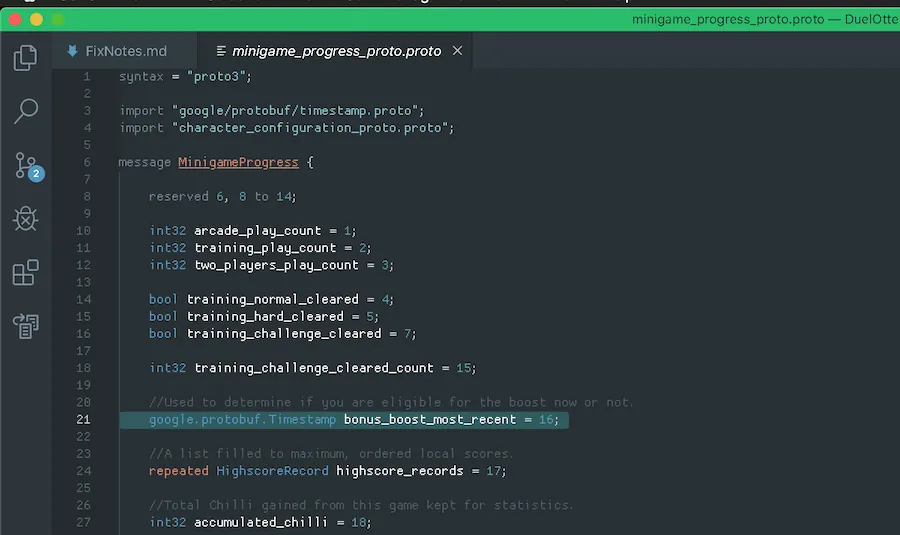
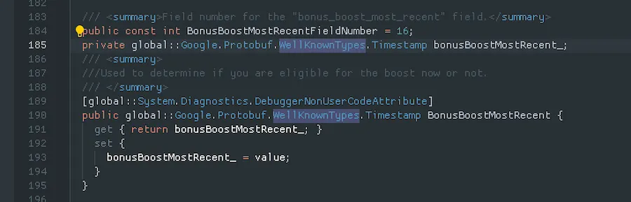

# Well-Known Types

Maybe you are thinking about storing time — for daily resets, and so on. Storing the `.ToString()` of a `DateTime`/`DateTimeOffset` is not a good idea; storing an integer of seconds/milliseconds since the Unix epoch and converting to `DateTimeOffset` later is better.

But instead of a generic `int32`/`int64` — which is error-prone when you look at it later and wonder what the number represents — Google already ships `Timestamp`, ready for use in the Protobuf DLL you include in your Unity project (`Google.Protobuf.WellKnownTypes.___`). You don't even have to copy Google's `.proto` for `Timestamp` into your game (that would instead cause a duplicate-declaration compile error).

Google's `Timestamp` [consists of two number fields](https://github.com/protocolbuffers/protobuf/blob/main/src/google/protobuf/timestamp.proto): an `int64` for seconds elapsed since the Unix epoch, and an `int32` of nanoseconds within that second for extra accuracy. Even better, Google provides utility methods to interface with C# — such as `public static Timestamp FromDateTimeOffset(DateTimeOffset dateTimeOffset);`.

Here's how you do it in your `.proto` file:

The `google/protobuf/` path is available for `import` seemingly from nowhere. Then you fully qualify it with `google.protobuf.__`, since Google used `package google.protobuf;`.

The resulting C# class looks like this:

See the other predefined [well-known types](https://protobuf.dev/reference/protobuf/google.protobuf/) — you'll find types already used for typical data such as `uint32` as well. Other useful ones include [`google.protobuf.Struct`](https://protobuf.dev/reference/protobuf/google.protobuf/#struct), which stores JSON-like key/value pairs where the key is a string and the value is a varying type, and [`google.protobuf.Value`](https://protobuf.dev/reference/protobuf/google.protobuf/#value) for just the varying-value part of a `Struct`. Generally, when you think you are going to use `google.protobuf.Any`, consider `Struct` first (unless it really is a byte stream).
